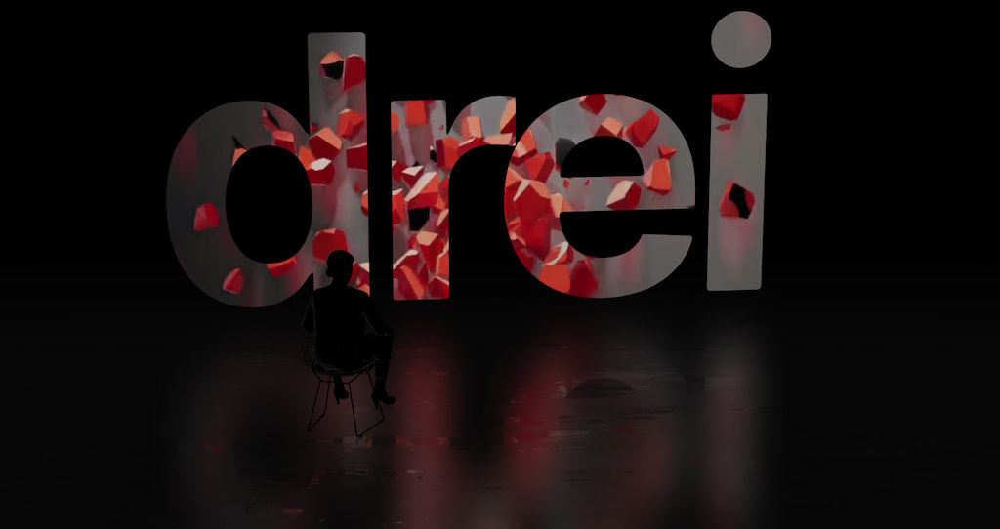

[](https://www.npmjs.com/package/@react-three/drei)
[](https://www.npmjs.com/package/@react-three/drei)
[](https://discord.gg/poimandres)

A growing collection of useful helpers and fully functional, ready-made abstractions for [@react-three/fiber](https://github.com/pmndrs/react-three-fiber). If you make a component that is generic enough to be useful to others, think about making it available here through a PR!

```bash
npm install @react-three/drei
```

:point_right: this package is using the stand-alone [`three-stdlib`](https://github.com/pmndrs/three-stdlib) instead of [`three/examples/jsm`](https://github.com/mrdoob/three.js/tree/master/examples/jsm). :point_left:

### Basic usage:

```jsx
import { PerspectiveCamera, PositionalAudio, ... } from '@react-three/drei'
```

### React-native:

```jsx
import { PerspectiveCamera, PositionalAudio, ... } from '@react-three/drei/native'
```

The `native` route of the library **does not** export `Html` or `Loader`. The default export of the library is `web` which **does** export `Html` and `Loader`.

### Index

<table>
  <tr>
    <td valign="top">
      <ul>
        <li><a href="#cameras">Cameras</a></li>
        <ul>
          <li><a href="#perspectivecamera">PerspectiveCamera</a></li>
          <li><a href="#orthographiccamera">OrthographicCamera</a></li>
          <li><a href="#cubecamera">CubeCamera</a></li>
        </ul>
        <li><a href="#controls">Controls</a></li>
        <ul>
          <li><a href="#controls">Controls</a></li>
          <li><a href="#controls">FlyControls</a></li>
          <li><a href="#controls">MapControls</a></li>
          <li><a href="#controls">DeviceOrientationControls</a></li>
          <li><a href="#controls">TrackballControls</a></li>
          <li><a href="#controls">ArcballControls</a></li>
          <li><a href="#controls">PointerLockControls</a></li>
          <li><a href="#controls">FirstPersonControls</a></li>
          <li><a href="#transformcontrols">TransformControls</a></li>
          <li><a href="#scrollcontrols">ScrollControls</a></li>
          <li><a href="#presentationcontrols">PresentationControls</a></li>
        </ul>
        <li><a href="#abstractions">Abstractions</a></li>
        <ul>
          <li><a href="#image">Image</a></li>
          <li><a href="#text">Text</a></li>
          <li><a href="#text3d">Text3D</a></li>
          <li><a href="#line">Line</a></li>
          <li><a href="#quadraticbezierline">QuadraticBezierLine</a></li>
          <li><a href="#cubicbezierline">CubicBezierLine</a></li>
          <li><a href="#positionalaudio">PositionalAudio</a></li>
          <li><a href="#billboard">Billboard</a></li>
          <li><a href="#gizmohelper">GizmoHelper</a></li>
          <li><a href="#effects">Effects</a></li>
          <li><a href="#gradienttexture">GradientTexture</a></li>
          <li><a href="#edges">Edges</a></li>
          <li><a href="#trail">Trail</a></li>
          <li><a href="#sampler">Sampler</a></li>
          <li><a href="#computedattribute">Computed Attribute</a></li>
          <li><a href="#clone">Clone</a></li>
          <li><a href="#useanimations">useAnimations</a></li>
        </ul>
        <li><a href="#shaders">Shaders</a></li>
        <ul>
          <li><a href="#meshreflectormaterial">MeshReflectorMaterial</a></li>
          <li><a href="#meshwobblematerial">MeshWobbleMaterial</a></li>
          <li><a href="#meshdistortmaterial">MeshDistortMaterial</a></li>
          <li><a href="#pointmaterial">PointMaterial</a></li>
          <li><a href="#softshadows">softShadows</a></li>
          <li><a href="#shadermaterial">shaderMaterial</a></li>
        </ul>
        <li><a href="#modifiers">Modifiers</a></li>
        <ul>
          <li><a href="#curvemodifier">CurveModifier</a></li>
        </ul>
      </ul>
    </td>
    <td valign="top">
      <ul>
        <li><a href="#misc">Misc</a></li>
        <ul>
          <li><a href="#html">Html</a></li>
          <li><a href="#cycleraycast">CycleRaycast</a></li>
          <li><a href="#select">Select</a></li>
          <li><a href="#stats">Stats</a></li>
          <li><a href="#usedepthbuffer">useDepthBuffer</a></li>
          <li><a href="#usecontextbridge">useContextBridge</a></li>
          <li><a href="#usefbo">useFBO</a></li>
          <li><a href="#usecamera">useCamera</a></li>
          <li><a href="#usedetectgpu">useDetectGPU</a></li>
          <li><a href="#usehelper">useHelper</a></li>
          <li><a href="#useaspect">useAspect</a></li>
          <li><a href="#usecursor">useCursor</a></li>
          <li><a href="#useintersect">useIntersect</a></li>
          <li><a href="#useboxprojectedenv">useBoxProjectedEnv</a></li>
          <li><a href="#useTrail">useTrail</a></li>
          <li><a href="#BBAnchor">BBAnchor</a></li>
        </ul>
        <li><a href="#loading">Loaders</a></li>
        <ul>
          <li><a href="#loader">Loader</a></li>
          <li><a href="#useprogress">useProgress</a></li>
          <li><a href="#usegltf">useGLTF</a></li>
          <li><a href="#usefbx">useFBX</a></li>
          <li><a href="#usetexture">useTexture</a></li>
          <li><a href="#usektx2">useKTX2</a></li>
          <li><a href="#usecubetexture">useCubeTexture</a></li>
        </ul>
        <li><a href="#performance">Performance</a></li>
        <ul>
          <li><a href="#instances">Instances</a></li>
          <li><a href="#merged">Merged</a></li>
          <li><a href="#points">Points</a></li>
          <li><a href="#segments">Segments</a></li>
          <li><a href="#detailed">Detailed</a></li>
          <li><a href="#preload">Preload</a></li>
          <li><a href="#bakeshadows">BakeShadows</a></li>
          <li><a href="#meshbounds">meshBounds</a></li>
          <li><a href="#adaptivedpr">AdaptiveDpr</a></li>
          <li><a href="#adaptiveevents">AdaptiveEvents</a></li>
          <li><a href="#usebvh">useBVH</a></li>
        </ul>
        <li><a href="#portals">Portals</a></li>        
        <ul>
          <li><a href="#view">View</a></li>
          <li><a href="#rendertexture">RenderTexture</a></li>
          <li><a href="#mask">Mask</a></li>
        </ul>
      </ul>
    </td>
    <td valign="top">
      <ul>
        <li><a href="#shapes">Shapes</a></li>
        <ul>
          <li><a href="#shapes">Plane</a></li>
          <li><a href="#shapes">Box</a></li>
          <li><a href="#shapes">Sphere</a></li>
          <li><a href="#shapes">Circle</a></li>
          <li><a href="#shapes">Cone</a></li>
          <li><a href="#shapes">Cylinder</a></li>
          <li><a href="#shapes">Tube</a></li>
          <li><a href="#shapes">Torus</a></li>
          <li><a href="#shapes">TorusKnot</a></li>
          <li><a href="#shapes">Ring</a></li>
          <li><a href="#shapes">Tetrahedron</a></li>
          <li><a href="#shapes">Polyhedron</a></li>
          <li><a href="#shapes">Icosahedron</a></li>
          <li><a href="#shapes">Octahedron</a></li>
          <li><a href="#shapes">Dodecahedron</a></li>
          <li><a href="#shapes">Extrude</a></li>
          <li><a href="#shapes">Lathe</a></li>
          <li><a href="#roundedbox">RoundedBox</a></li>
          <li><a href="#screenquad">Screenquad</a></li>
        </ul>
        <li><a href="#staging">Staging</a></li>
        <ul>
          <li><a href="#center">Center</a></li>
          <li><a href="#bounds">Bounds</a></li>
          <li><a href="#camerashake">CameraShake</a></li>
          <li><a href="#float">Float</a></li>
          <li><a href="#stage">Stage</a></li>
          <li><a href="#backdrop">Backdrop</a></li>
          <li><a href="#environment">Environment</a></li>
          <li><a href="#lightformer">Lightformer</a></li>
          <li><a href="#spotlight">SpotLight</a></li>
          <li><a href="#shadow">Shadow</a></li>
          <li><a href="#contactshadows">ContactShadows</a></li>
          <li><a href="#sky">Sky</a></li>
          <li><a href="#stars">Stars</a></li>
          <li><a href="#sparkles">Sparkles</a></li>
          <li><a href="#cloud">Cloud</a></li>
          <li><a href="#usematcaptexture">useMatcapTexture</a></li>
          <li><a href="#usenormaltexture">useNormalTexture</a></li>
        </ul>
      </ul>
    </td>
  </tr>
</table>

# Cameras

#### PerspectiveCamera

[](https://drei.vercel.app/?path=/story/camera-perspectivecamera--perspective-camera-scene-st)

A responsive [THREE.PerspectiveCamera](https://threejs.org/docs/#api/en/cameras/PerspectiveCamera) that can set itself as the default.

```jsx
<PerspectiveCamera makeDefault {...props} />
<mesh />
```

You can also give it children, which will now occupy the same position as the camera and follow along as it moves.

```jsx
<PerspectiveCamera makeDefault {...props}>
  <mesh />
</PerspectiveCamera>
```

You can also drive it manually, it won't be responsive and you have to calculate aspect ration yourself.

```jsx
<PerspectiveCamera manual aspect={...} onUpdate={(c) => c.updateProjectionMatrix()}>
```

#### OrthographicCamera

[](https://drei.vercel.app/?path=/story/camera-orthographiccamera--orthographic-camera-scene-st)

A responsive [THREE.OrthographicCamera](https://threejs.org/docs/#api/en/cameras/OrthographicCamera) that can set itself as the default.

```jsx
<OrthographicCamera makeDefault {...props}>
  <mesh />
</OrthographicCamera>
```

#### CubeCamera

[](https://drei.pmnd.rs/?path=/story/camera-cubecamera--default-story)

A [THREE.CubeCamera](https://threejs.org/docs/#api/en/cameras/CubeCamera) that returns its texture as a render-prop. It makes children invisible while rendering to the internal buffer so that they are not included in the reflection.

Using the `frames` prop you can control if this camera renders indefinitively or statically (a given number of times).
If you have two static objects in the scene, make it `frames={2}` for instance, so that both objects get to "see" one another in the reflections, which takes multiple renders.
If you have moving objects, unset the prop and use a smaller `resolution` instead.

```jsx
<CubeCamera resolution={256} frames={Infinity} fog={customFog} near={1} far={1000}>
  {(texture) => (
    <mesh>
      <sphereGeometry />
      <meshStandardMaterial envMap={texture} />
    </mesh>
  )}
</CubeCamera>
```

# Controls

If available controls have damping enabled by default, they manage their own updates, remove themselves on unmount, are compatible with the `frameloop="demand"` canvas-flag. They inherit all props from their underlying [THREE controls](https://github.com/mrdoob/three.js/tree/master/examples/jsm/controls). They are the first effects to run before all other useFrames, to ensure that other components may mutate the camera on top of them.

Some controls allow you to set `makeDefault`, similar to, for instance, PerspectiveCamera. This will set @react-three/fiber's `controls` field in the root store. This can make it easier in situations where you want controls to be known and other parts of the app could respond to it. Some drei controls already take it into account, like CameraShake, Gizmo and TransformControls.

Drei currently exports OrbitControls [](https://drei.vercel.app/?path=/story/controls-orbitcontrols--orbit-controls-story), MapControls [](https://drei.vercel.app/?path=/story/controls-mapcontrols--map-controls-scene-st), TrackballControls, ArcballControls, FlyControls, DeviceOrientationControls, PointerLockControls [](https://drei.vercel.app/?path=/story/controls-pointerlockcontrols--pointer-lock-controls-scene-st), FirstPersonControls [](https://drei.vercel.app/?path=/story/controls-firstpersoncontrols--first-person-controls-story)

All controls react to the default camera. If you have a `<PerspectiveCamera makeDefault />` in your scene, they will control it. If you need to inject an imperative camera or one that isn't the default, use the `camera` prop: `<OrbitControls camera={MyCamera} />`.

PointerLockControls additionally supports a `selector` prop, which enables the binding of `click` event handlers for control activation to other elements than `document` (e.g. a 'Click here to play' button). All elements matching the `selector` prop will activate the controls. It will also center raycast events by default, so regular onPointerOver/etc events on meshes will continue to work.

# TransformControls

[](https://drei.vercel.app/?path=/story/controls-transformcontrols--transform-controls-story)

<p>
  <a href="https://codesandbox.io/s/btsbj"></a>
</p>

An abstraction around [THREE.TransformControls](https://threejs.org/docs/#examples/en/controls/TransformControls).

You can wrap objects which then receive a transform gizmo.

```jsx
<TransformControls mode="translate">
  <mesh />
</TransformControls>
```

You could also reference the object which might make it easier to exchange the target. Now the object does not have to be part of the same sub-graph. References can be plain objects or React.MutableRefObjects.

```jsx
<TransformControls object={mesh} mode="translate">
<mesh ref={mesh} />
```

If you are using other controls (Orbit, Trackball, etc), you will notice how they interfere, dragging one will affect the other. Default-controls will temporarily be disabled automatically when the user is pulling on the transform gizmo.

```jsx
<TransformControls mode="translate" />
<OrbitControls makeDefault />
```

# ScrollControls


<p>
  <a href="https://codesandbox.io/s/l4klb"></a>
  <a href="https://codesandbox.io/s/4m0d0"></a>
  <a href="https://codesandbox.io/s/gsm1y"></a>
  <a href="https://codesandbox.io/s/x8gvs"></a>
  <a href="https://codesandbox.io/s/yjhzv"></a>
  <a href="https://codesandbox.io/s/4jr4p"></a>
</p>

Scroll controls create a HTML scroll container in front of the canvas. Everything you drop into the `<Scroll>` component will be affected.

You can listen and react to scroll with the `useScroll` hook which gives you useful data like the current scroll `offset`, `delta` and functions for range finding: `range`, `curve` and `visible`. The latter functions are especially useful if you want to react to the scroll offset, for instance if you wanted to fade things in and out if they are in or out of view.

```jsx
<ScrollControls
  pages={3} // Each page takes 100% of the height of the canvas
  distance={1} // A factor that increases scroll bar travel (default: 1)
  damping={4} // Friction, higher is faster (default: 4)
  horizontal={false} // Can also scroll horizontally (default: false)
  infinite={false} // Can also scroll infinitely (default: false)
>
  {/* You can have components in here, they are not scrolled, but they can still
      react to scroll by using useScroll! */}
  <Scroll>
    <Foo position={[0, 0, 0]} />
    <Foo position={[0, viewport.height, 0]} />
    <Foo position={[0, viewport.height * 1, 0]} />
  </Scroll>
  <Scroll html>
    <h1>html in here (optional)</h1>
    <h1 style={{ top: '100vh' }}>second page</h1>
    <h1 style={{ top: '200vh' }}>third page</h1>
  </Scroll>
</ScrollControls>

function Foo(props) {
  const ref = useRef()
  const data = useScroll()
  useFrame(() => {
    // data.offset = current scroll position, between 0 and 1, dampened
    // data.delta = current delta, between 0 and 1, dampened

    // Will be 0 when the scrollbar is at the starting position,
    // then increase to 1 until 1 / 3 of the scroll distance is reached
    const a = data.range(0, 1 / 3)
    // Will start increasing when 1 / 3 of the scroll distance is reached,
    // and reach 1 when it reaches 2 / 3rds.
    const b = data.range(1 / 3, 1 / 3)
        // Same as above but with a margin of 0.1 on both ends
    const c = data.range(1 / 3, 1 / 3, 0.1)
    // Will move between 0-1-0 for the selected range
    const d = data.curve(1 / 3, 1 / 3)
    // Same as above, but with a margin of 0.1 on both ends
    const d = data.curve(1 / 3, 1 / 3, 0.1)
    // Returns true if the offset is in range and false if it isn't
    const e = data.visible(2 / 3, 1 / 3)
    // The visible function can also receive a margin
    const f = data.visible(2 / 3, 1 / 3, 0.1)
  })
  return <mesh ref={ref} {...props} />
```

# PresentationControls


<p>
  <a href="https://codesandbox.io/s/kheke"></a>
  <a href="https://codesandbox.io/s/qyz5r"></a>
</p>

Semi-OrbitControls with spring-physics, polar zoom and snap-back, for presentational purposes. These controls do not turn the camera but will spin their contents. They will not suddenly come to rest when they reach limits like OrbitControls do, but rather smoothly anticipate stopping position.

```jsx
<PresentationControls
  global={false} // Spin globally or by dragging the model
  cursor={true} // Whether to toggle cursor style on drag
  snap={false} // Snap-back to center (can also be a spring config)
  speed={1} // Speed factor
  zoom={1} // Zoom factor when half the polar-max is reached
  rotation={[0, 0, 0]} // Default rotation
  polar={[0, Math.PI / 2]} // Vertical limits
  azimuth={[-Infinity, Infinity]} // Horizontal limits
  config={{ mass: 1, tension: 170, friction: 26 }} // Spring config
>
  <mesh />
</PresentationControls>
```

# Shapes

[Buffer-geometry](https://threejs.org/docs/#api/en/core/BufferGeometry) short-cuts for Plane, Box, Sphere, Circle, Cone, Cylinder, Tube, Torus, TorusKnot, Ring, Tetrahedron, Polyhedron, Icosahedron, Octahedron, Dodecahedron, Extrude, Lathe.

```jsx
<Plane args={[2, 2]} />
<Sphere>
  <meshBasicMaterial color="hotpink" />
</Sphere>
```

#### RoundedBox

A box buffer geometry with rounded corners, done with extrusion.

```jsx
<RoundedBox args={[1, 1, 1]} radius={0.05} smoothness={4} {...meshProps}>
  <meshPhongMaterial color="#f3f3f3" wireframe />
</RoundedBox>
```

#### ScreenQuad

```jsx
<ScreenQuad>
  <myMaterial />
</ScreenQuad>
```

A triangle that fills the screen, ideal for full-screen fragment shader work (raymarching, postprocessing).
👉 [Why a triangle?](https://www.cginternals.com/en/blog/2018-01-10-screen-aligned-quads-and-triangles.html)
👉 [Use as a post processing mesh](https://medium.com/@luruke/simple-postprocessing-in-three-js-91936ecadfb7)

# Abstractions

#### Image

<p>
  <a href="https://codesandbox.io/s/l4klb"></a>
  <a href="https://codesandbox.io/s/gsm1y"></a>
  <a href="https://codesandbox.io/s/x8gvs"></a>
  <a href="https://codesandbox.io/s/yjhzv"></a>
</p>

A shader-based image component with auto-cover (similar to css/background: cover).

```jsx
function Foo() {
  const ref = useRef()
  useFrame(() => {
    ref.current.material.zoom = ... // 1 and higher
    ref.current.material.grayscale = ... // between 0 and 1
    ref.current.material.color.set(...) // mix-in color
  })
  return <Image ref={ref} url="/file.jpg" />
}
```

To make the material transparent:

```jsx
<Image url="/file.jpg" transparent opacity={0.5} />
```

#### Text

[](https://drei.vercel.app/?path=/story/abstractions-text--text-st) 

<p>
  <a href="https://codesandbox.io/s/yup2o"></a>
</p>

Hi-quality text rendering w/ signed distance fields (SDF) and antialiasing, using [troika-3d-text](https://github.com/protectwise/troika/tree/master/packages/troika-3d-text). All of troikas props are valid! Text is suspense-based!

```jsx
<Text color="black" anchorX="center" anchorY="middle">
  hello world!
</Text>
```

Text will suspend while loading the font data, but in order to completely avoid FOUC you can pass the characters it needs to render.

```jsx
<Text font={fontUrl} characters="abcdefghijklmnopqrstuvwxyz0123456789!">
  hello world!
</Text>
```

#### Text3D

[](https://drei.vercel.app/?path=/story/abstractions-text3d--text-3-d-st) 

Render 3D text using ThreeJS's `TextGeometry`.

Text3D will suspend while loading the font data, you can also load the font yourself before passing it in. Text3D requires fonts in JSON format generated through (typeface.json)[http://gero3.github.io/facetype.js/] either as a path to a JSON files or a JSON object.

```jsx
<Text3D font={fontUrl} {...textOptions}>
  Hello world!
  <meshNormalMaterial />
</Text3D>
```

You can use any material. `textOptions` are options you'd pass to the `TextGeometry` constructor. Find more information about available options [here](https://threejs.org/docs/index.html?q=textg#examples/en/geometries/TextGeometry).

#### Line

[](https://drei.vercel.app/?path=/story/abstractions-line--basic-line)

Renders a THREE.Line2.

```jsx
<Line
  points={[[0, 0, 0], ...]}       // Array of points
  color="black"                   // Default
  lineWidth={1}                   // In pixels (default)
  dashed={false}                  // Default
  vertexColors={[[0, 0, 0], ...]} // Optional array of RGB values for each point
  {...lineProps}                  // All THREE.Line2 props are valid
  {...materialProps}              // All THREE.LineMaterial props are valid
/>
```

#### QuadraticBezierLine

[](https://drei.vercel.app/?path=/story/abstractions-line--quadratic-bezier)

<p>
  <a href="https://codesandbox.io/s/2ij9u"></a>
</p>

Renders a THREE.Line2 using THREE.QuadraticBezierCurve3 for interpolation.

```jsx
<QuadraticBezierLine
  start={[0, 0, 0]}               // Starting point, can be an array or a vec3
  end={[10, 0, 10]}               // Ending point, can be an array or a vec3
  mid={[5, 0, 5]}                 // Optional control point, can be an array or a vec3
  color="black"                   // Default
  lineWidth={1}                   // In pixels (default)
  dashed={false}                  // Default
  vertexColors={[[0, 0, 0], ...]} // Optional array of RGB values for each point
  {...lineProps}                  // All THREE.Line2 props are valid
  {...materialProps}              // All THREE.LineMaterial props are valid
/>
```

You can also update the line runtime.

```jsx
const ref = useRef()
useFrame((state) => {
  ref.current.setPoints(
    [0, 0, 0],
    [10, 0, 0],
    // [5, 0, 0] // Optional: mid-point
  )
}, [])
return <QuadraticBezierLine ref={ref} />
}
```

#### CubicBezierLine

[](https://drei.vercel.app/?path=/story/abstractions-line--cubic-bezier)

Renders a THREE.Line2 using THREE.CubicBezierCurve3 for interpolation.

```jsx
<CubicBezierLine
  start={[0, 0, 0]}               // Starting point
  end={[10, 0, 10]}               // Ending point
  midA={[5, 0, 0]}                // First control point
  midB={[0, 0, 5]}                // Second control point
  color="black"                   // Default
  lineWidth={1}                   // In pixels (default)
  dashed={false}                  // Default
  vertexColors={[[0, 0, 0], ...]} // Optional array of RGB values for each point
  {...lineProps}                  // All THREE.Line2 props are valid
  {...materialProps}              // All THREE.LineMaterial props are valid
/>
```

#### PositionalAudio

<p>
  <a href="https://codesandbox.io/s/gkfhr"></a>
</p>

[](https://drei.vercel.app/?path=/story/abstractions-positionalaudio--positional-audio-scene-st) 

A wrapper around [THREE.PositionalAudio](https://threejs.org/docs/#api/en/audio/PositionalAudio). Add this to groups or meshes to tie them to a sound that plays when the camera comes near.

```jsx
<PositionalAudio
  url="/sound.mp3"
  distance={1}
  loop
  {...props} // All THREE.PositionalAudio props are valid
/>
```

#### Billboard

[](https://drei.pmnd.rs/?path=/story/abstractions-billboard--billboard-st)

Adds a `<group />` that always faces the camera.

```jsx
<Billboard
  follow={true}
  lockX={false}
  lockY={false}
  lockZ={false} // Lock the rotation on the z axis (default=false)
>
  <Text fontSize={1}>I'm a billboard</Text>
</Billboard>
```

#### GizmoHelper

[](https://drei.pmnd.rs/?path=/story/gizmos-gizmohelper--gizmo-helper-story)

Used by widgets that visualize and control camera position.

Two example gizmos are included: GizmoViewport and GizmoViewcube, and `useGizmoContext` makes it easy to create your own.

Make sure to set the `makeDefault` prop on your controls, in that case you do not have to define the onTarget and onUpdate props.

```jsx
<GizmoHelper
  alignment="bottom-right" // widget alignment within scene
  margin={[80, 80]} // widget margins (X, Y)
  onUpdate={/* called during camera animation  */}
  onTarget={/* return current camera target (e.g. from orbit controls) to center animation */}
  renderPriority={/* use renderPriority to prevent the helper from disappearing if there is another useFrame(..., 1)*/}
>
  <GizmoViewport axisColors={['red', 'green', 'blue']} labelColor="black" />
  {/* alternative: <GizmoViewcube /> */}
</GizmoHelper>
```

#### Effects

Abstraction around threes own [EffectComposer](https://threejs.org/docs/#examples/en/postprocessing/EffectComposer). By default it will prepend a render-pass and a gammacorrection-pass. Children are cloned, `attach` is given to them automatically. You can only use passes or effects in there.

By default it creates a render target with HalfFloatType, RGBAFormat and gl.outputEncoding. You can change all of this to your liking, inspect the types.

```jsx
import { SSAOPass } from "three-stdlib"

extend({ SSAOPass })

<Effects multisamping={8} renderIndex={1} disableGamma={false} disableRenderPass={false} disableRender={false}>
  <sSAOPass args={[scene, camera, 100, 100]} kernelRadius={1.2} kernelSize={0} />
</Effects>
```

#### GradientTexture

<p>
  <a href="https://codesandbox.io/s/l03yb"></a>
</p>

A declarative THREE.Texture which attaches to "map" by default. You can use this to create gradient backgrounds.

```jsx
<mesh>
  <planeGeometry />
  <meshBasicMaterial>
    <GradientTexture
      stops={[0, 1]} // As many stops as you want
      colors={['aquamarine', 'hotpink']} // Colors need to match the number of stops
      size={1024} // Size is optional, default = 1024
    />
  </meshBasicMaterial>
</mesh>
```

#### Edges

<p>
  <a href="https://codesandbox.io/s/ny3p4"></a>
</p>

Abstracts [THREE.EdgesGeometry](https://threejs.org/docs/#api/en/geometries/EdgesGeometry). It pulls the geometry automatically from its parent, optionally you can ungroup it and give it a `geometry` prop. You can give it children, for instance a custom material.

```jsx
<mesh>
  <boxGeometry />
  <meshBasicMaterial />
  <Edges
    scale={1.1}
    threshold={15} // Display edges only when the angle between two faces exceeds this value (default=15 degrees)
    color="white"
  />
</mesh>
```

#### Trail

[](https://drei.vercel.app/?path=/story/misc-trail--use-trail-st)

A declarative, `three.MeshLine` based Trails implementation. You can attach it to any mesh and it will give it a beautiful trail.

Props defined bellow with their default values.

```jsx
<Trail
  width={0.2} // Width of the line
  color={'hotpink'} // Color of the line
  length={1} // Length of the line
  decay={1} // How fast the line fades away
  local={false} // Wether to use the target's world or local positions
  stride={0} // Min distance between previous and current point
  interval={1} // Number of frames to wait before next calculation
  target={undefined} // Optional target. This object will produce the trail.
  attenuation={(width) => width} // A function to define the width in each point along it.
>
  {/* If `target` is not defined, Trail will use the first `Object3D` child as the target. */}
  <mesh>
    <sphereGeometry />
    <meshBasicMaterial />
  </mesh>

  {/* You can optionally define a custom meshLineMaterial to use. */}
  {/* <meshLineMaterial color={"red"} /> */}
</Trail>
```

👉 Inspired by [TheSpite's Codevember 2021 #9](https://spite.github.io/codevember-2021/9/)

#### Sampler

[](https://drei.vercel.app/?path=/story/misc-sampler--sampler-st)

<p>
  <a href="https://codesandbox.io/s/ehflx3">
    
  </a> <br />
  <small>– <a href="https://codesandbox.io/s/ehflx3">Complex Demo</a> by <a href="https://twitter.com/CantBeFaraz">@CantBeFaraz</a></small> <br />
  <small>– <a href="https://codesandbox.io/s/k6rcp2">Simple Demo</a> by <a href="https://twitter.com/ggsimm">@ggsimm</a></small>
</p>

Declarative abstraction around MeshSurfaceSampler & InstancedMesh.
It samples points from the passed mesh and transforms an InstancedMesh's matrix to distribute instances on the points.

Check the demos & code for more.

You can either pass a Mesh and InstancedMesh as children:

```tsx
// This simple example scatters 1000 spheres on the surface of the sphere mesh.
<Sampler
  weight={"normal"} // the name of the attribute to be used as sampling weight
  transform={transformPoint} // a function that transforms each instance given a sample. See the examples for more.
>
  <mesh>
    <sphereGeometry args={[2]} />
  </mesh>

  <instancedMesh args={[null, null, 1_000]}>
    <sphereGeometry args={[0.1]}>
  </instancedMesh>
</Sampler>
```

or use refs when you can't compose declaratively:

```tsx
const { nodes } = useGLTF('my/mesh/url')
const mesh = useRef(nodes)
const instances = useRef()

return <>
  <instancedMesh args={[null, null, 1_000]}>
    <sphereGeometry args={[0.1]}>
  </instancedMesh>

  <Sampler mesh={mesh} instances={instances}>
</>
```

#### ComputedAttribute

[](https://drei.vercel.app/?path=/story/misc-sampler--sampler-weight-st)

Create and attach an attribute declaratively.

```tsx
<sphereGeometry>
  <ComputedAttribute
    // attribute will be added to the geometry with this name
    name="my-attribute-name"
    compute={(geometry) => {
      // ...someLogic;
      return new THREE.BufferAttribute([1, 2, 3], 1)
    }}
    // you can pass any BufferAttribute prop to this component, eg.
    usage={THREE.StaticReadUsage}
  />
</sphereGeometry>
```

#### Clone

<p>
  <a href="https://codesandbox.io/s/42glz0"></a>
</p>

Declarative abstraction around THREE.Object3D.clone. This is useful when you want to create a shallow copy of an existing fragment (and Object3D, Groups, etc) into your scene, for instance a group from a loaded GLTF. This clone is now re-usable, but it will still refer to the original geometries and materials.

```ts
<Clone
  /** Any pre-existing THREE.Object3D (groups, meshes, ...), or an array of objects */
  object: THREE.Object3D | THREE.Object3D[]
  /** Children will be placed within the object, or within the group that holds arrayed objects */
  children?: React.ReactNode
  /** Can clone materials and/or geometries deeply (default: false) */
  deep?: boolean | 'materialsOnly' | 'geometriesOnly'
  /** The property keys it will shallow-clone (material, geometry, visible, ...) */
  keys?: string[]
  /** Can either spread over props or fill in JSX children, applies to every mesh within */
  inject?: MeshProps | React.ReactNode | ((object: THREE.Object3D) => React.ReactNode)
  /** Short access castShadow, applied to every mesh within */
  castShadow?: boolean
  /** Short access receiveShadow, applied to every mesh within */
  receiveShadow?: boolean
/>
```

You create a shallow clone by passing a pre-existing object to the `object` prop.

```jsx
const { nodes } = useGLTF(url)
return (
  <Clone object={nodes.table} />
```

Or, multiple objects:

```jsx
<Clone object={[nodes.foo, nodes.bar]} />
```

You can dynamically insert objects, these will apply to anything that isn't a group or a plain object3d (meshes, lines, etc):

```jsx
<Clone object={nodes.table} inject={<meshStandardMaterial color="green" />} />
```

Or make inserts conditional:

```jsx
<Clone object={nodes.table} inject={
  {(object) => (object.name === 'table' ? <meshStandardMaterial color="green" /> : null)}
} />
```

#### useAnimations

[](https://drei.pmnd.rs/?path=/story/abstractions-useanimations--use-animations-st)

<p>
  <a href="https://codesandbox.io/s/pecl6"></a>
</p>

A hook that abstracts [AnimationMixer](https://threejs.org/docs/#api/en/animation/AnimationMixer).

```jsx
const { nodes, materials, animations } = useGLTF(url)
const { ref, mixer, names, actions, clips } = useAnimations(animations)
useEffect(() => {
  actions?.jump.play()
})
return (
  <mesh ref={ref} />
```

The hook can also take a pre-existing root (which can be a plain object3d or a reference to one):

```jsx
const { scene, animations } = useGLTF(url)
const { actions } = useAnimations(animations, scene)
return <primitive object={scene} />
```

# Shaders

#### MeshReflectorMaterial

[](https://drei.vercel.app/?path=/story/shaders-meshreflectormaterial--reflector-st)

<p>
  <a href="https://codesandbox.io/s/lx2h8"></a>
  <a href="https://codesandbox.io/s/l900i"></a>
</p>

Easily add reflections and/or blur to any mesh. It takes surface roughness into account for a more realistic effect. This material extends from [THREE.MeshStandardMaterial](https://threejs.org/docs/#api/en/materials/MeshStandardMaterial) and accepts all its props.

```jsx
<mesh>
  <planeGeometry />
  <MeshReflectorMaterial
    blur={[0, 0]} // Blur ground reflections (width, heigt), 0 skips blur
    mixBlur={0} // How much blur mixes with surface roughness (default = 1)
    mixStrength={1} // Strength of the reflections
    mixContrast={1} // Contrast of the reflections
    resolution={256} // Off-buffer resolution, lower=faster, higher=better quality, slower
    mirror={0} // Mirror environment, 0 = texture colors, 1 = pick up env colors
    depthScale={0} // Scale the depth factor (0 = no depth, default = 0)
    minDepthThreshold={0.9} // Lower edge for the depthTexture interpolation (default = 0)
    maxDepthThreshold={1} // Upper edge for the depthTexture interpolation (default = 0)
    depthToBlurRatioBias={0.25} // Adds a bias factor to the depthTexture before calculating the blur amount [blurFactor = blurTexture * (depthTexture + bias)]. It accepts values between 0 and 1, default is 0.25. An amount > 0 of bias makes sure that the blurTexture is not too sharp because of the multiplication with the depthTexture
    distortion={1} // Amount of distortion based on the distortionMap texture
    distortionMap={distortionTexture} // The red channel of this texture is used as the distortion map. Default is null
    debug={0} /* Depending on the assigned value, one of the following channels is shown:
      0 = no debug
      1 = depth channel
      2 = base channel
      3 = distortion channel
      4 = lod channel (based on the roughness)
    */
   reflectorOffset={0.2} // Offsets the virtual camera that projects the reflection. Useful when the reflective surface is some distance from the object's origin (default = 0)
  >
</mesh>
```

#### MeshWobbleMaterial

[](https://drei.vercel.app/?path=/story/shaders-meshwobblematerial--mesh-wobble-material-st)

This material makes your geometry wobble and wave around. It was taken from the [threejs-examples](https://threejs.org/examples/#webgl_materials_modified) and adapted into a self-contained material.

```jsx
<mesh>
  <boxGeometry />
  <MeshWobbleMaterial factor={1} speed={10} />
</mesh>
```

#### MeshDistortMaterial

[](https://drei.vercel.app/?path=/story/shaders-meshdistortmaterial--mesh-distort-material-st)

<p>
  <a href="https://codesandbox.io/s/l03yb"></a>
</p>

This material makes your geometry distort following simplex noise.

```jsx
<mesh>
  <boxGeometry />
  <MeshDistortMaterial distort={1} speed={10} />
</mesh>
```

#### PointMaterial

<p>
  <a href="https://codesandbox.io/s/eq7sc"></a>
</p>

Antialiased round dots. It takes the same props as regular [THREE.PointsMaterial](https://threejs.org/docs/index.html?q=PointsMaterial#api/en/materials/PointsMaterial) on which it is based.

```jsx
<points>
  <PointMaterial transparent vertexColors size={15} sizeAttenuation={false} depthWrite={false} />
</points>
```

#### softShadows

[](https://drei.vercel.app/?path=/story/shaders-softshadows--soft-shadows-st)

<p>
  <a href="https://codesandbox.io/s/dh2jc"></a>
</p>

Injects [percent closer soft shadows (pcss)](https://threejs.org/examples/#webgl_shadowmap_pcss) into threes shader chunk.

```jsx
softShadows({
  frustum: 3.75,
  size: 0.005,
  near: 9.5,
  samples: 17,
  rings: 11, // Rings (default: 11) must be a int
})
```

#### shaderMaterial

[](https://drei.vercel.app/?path=/story/shaders-shadermaterial--shader-material-story)

<p>
  <a href="https://codesandbox.io/s/ni6v4"></a>
</p>

Creates a THREE.ShaderMaterial for you with easier handling of uniforms, which are also automatically declared as setter/getters on the object.

```jsx
import { extend } from '@react-three/fiber'
import glsl from 'babel-plugin-glsl/macro'

const ColorShiftMaterial = shaderMaterial(
  { time: 0, color: new THREE.Color(0.2, 0.0, 0.1) },
  // vertex shader
  glsl`
    varying vec2 vUv;
    void main() {
      vUv = uv;
      gl_Position = projectionMatrix * modelViewMatrix * vec4(position, 1.0);
    }
  `,
  // fragment shader
  glsl`
    uniform float time;
    uniform vec3 color;
    varying vec2 vUv;
    void main() {
      gl_FragColor.rgba = vec4(0.5 + 0.3 * sin(vUv.yxx + time) + color, 1.0);
    }
  `
)

extend({ ColorShiftMaterial })

// in your component
<mesh>
  <colorShiftMaterial color="hotpink" time={1} />
</mesh>
```

`shaderMaterial` attaches a unique `key` property to the prototype class. If you wire it to Reacts own `key` property, you can enable hot-reload.

```jsx
import { ColorShiftMaterial } from './ColorShiftMaterial'

extend({ ColorShiftMaterial })

// in your component
<colorShiftMaterial key={ColorShiftMaterial.key} color="hotpink" time={1} />
```

# Modifiers

#### CurveModifier

[](https://drei.pmnd.rs/?path=/story/modifiers-curvemodifier)

Given a curve will replace the children of this component with a mesh that move along said curve calling the property `moveAlongCurve` on the passed ref. Uses [three's Curve Modifier](https://threejs.org/examples/#webgl_modifier_curve)

```jsx
const curveRef = useRef()

const curve = React.useMemo(() => new THREE.CatmullRomCurve3([...handlePos], true, 'centripetal'), [handlePos])

return (
  <CurveModifier ref={curveRef} curve={curve}>
    <mesh>
      <boxGeometry args={[10, 10]} />
    </mesh>
  </CurveModifier>
)
```

# Misc

#### useContextBridge

[](https://drei.pmnd.rs/?path=/story/misc-usecontextbridge--use-context-bridge-st)

Allows you to forward contexts provided above the `<Canvas />` to be consumed from within the `<Canvas />` normally

```jsx
function SceneWrapper() {
  // bridge any number of contexts
  // Note: These contexts must be provided by something above this SceneWrapper component
  //       You cannot render the providers for these contexts inside this component
  const ContextBridge = useContextBridge(ThemeContext, GreetingContext)
  return (
    <Canvas>
      <ContextBridge>
        <Scene />
      </ContextBridge>
    </Canvas>
  )
}

function Scene() {
  // we can now consume a context within the Canvas
  const theme = React.useContext(ThemeContext)
  const greeting = React.useContext(GreetingContext)
  return (
    //...
  )
}
```

#### Html

[](https://drei.vercel.app/?path=/story/misc-html--html-st) 

<p>
  <a href="https://codesandbox.io/s/qyz5r"></a>
  <a href="https://codesandbox.io/s/9keg6"></a>
  <a href="https://codesandbox.io/s/6oei7"></a>
</p>

Allows you to tie HTML content to any object of your scene. It will be projected to the objects whereabouts automatically.

```jsx
<Html
  as='div' // Wrapping element (default: 'div')
  wrapperClass // The className of the wrapping element (default: undefined)
  prepend // Project content behind the canvas (default: false)
  center // Adds a -50%/-50% css transform (default: false) [ignored in transform mode]
  fullscreen // Aligns to the upper-left corner, fills the screen (default:false) [ignored in transform mode]
  distanceFactor={10} // If set (default: undefined), children will be scaled by this factor, and also by distance to a PerspectiveCamera / zoom by a OrthographicCamera.
  zIndexRange={[100, 0]} // Z-order range (default=[16777271, 0])
  portal={domnodeRef} // Reference to target container (default=undefined)
  transform // If true, applies matrix3d transformations (default=false)
  sprite // Renders as sprite, but only in transform mode (default=false)
  calculatePosition={(el: Object3D, camera: Camera, size: { width: number; height: number }) => number[]} // Override default positioning function. (default=undefined) [ignored in transform mode]
  occlude={[ref]} // Can be true or a Ref<Object3D>[], true occludes the entire scene (default: undefined)
  onOcclude={(visible) => null} // Callback when the visibility changes (default: undefined)
  {...groupProps} // All THREE.Group props are valid
  {...divProps} // All HTMLDivElement props are valid
>
  <h1>hello</h1>
  <p>world</p>
</Html>
```

Html can hide behind geometry using the `occlude` prop.

```jsx
// Raytrace the entire scene
<Html occlude />
// Raytrace only specific elements
<Html occlude={[ref1, ref2]} />
```

When the Html object hides it sets the opacity prop on the innermost div. If you want to animate or control the transition yourself then you can use `onOcclude`.

```jsx
const [hidden, set] = useState()

<Html
  occlude
  onOcclude={set}
  style={{
    transition: 'all 0.5s',
    opacity: hidden ? 0 : 1,
    transform: `scale(${hidden ? 0.5 : 1})`
  }} />
```

#### CycleRaycast


<p>
  <a href="https://codesandbox.io/s/ls503"></a>
</p>

This component allows you to cycle through all objects underneath the cursor with optional visual feedback. This can be useful for non-trivial selection, CAD data, housing, everything that has layers. It does this by changing the raycasters filter function and then refreshing the raycaster.

For this to work properly your event handler have to call `event.stopPropagation()`, for instance in `onPointerOver` or `onClick`, only one element can be selective for cycling to make sense.

```jsx
<CycleRaycast
  preventDefault={true} // Call event.preventDefault() (default: true)
  scroll={true} // Wheel events (default: true)
  keyCode={9} // Keyboard events (default: 9 [Tab])
  onChanged={(objects, cycle) => console.log(objects, cycle)} // Optional onChanged event
/>
```

#### Select


<p>
  <a href="https://codesandbox.io/s/ny3p4"></a>
</p>

This component allows you to select/unselect objects by clicking on them. It keeps track of the currently selected objects and can select multiple objects (with the shift key). Nested components can request the current selection (which is always an array) with the `useSelect` hook. With the `box` prop it will let you shift-box-select objects by holding and draging the cursor over multiple objects. Optionally you can filter the selected items as well as define in which shape they are stored by defining the `filter` prop.

```jsx
<Select box multiple onChange={console.log} filter={items => items}>
  <Foo />
  <Bar />
</Select>

function Foo() {
  const selected = useSelect()
```

#### Stats

[](https://drei.vercel.app/?path=/story/misc-stats--default-story)

Adds [stats](https://github.com/mrdoob/stats.js/) to document.body. It takes over the render-loop!

```jsx
<Stats showPanel={0} className="stats" {...props} />
```

You can choose to mount Stats to a different DOM Element - for example, for custom styling:

```jsx
const node = useRef(document.createElement('div'))

useEffect(() => {
  node.current.id = 'test'
  document.body.appendChild(node.current)

  return () => document.body.removeChild(node.current)
}, [])

return <Stats parent={parent} />
```

#### useDepthBuffer

<p>
  <a href="https://codesandbox.io/s/tx1pq"></a>
</p>

Renders the scene into a depth-buffer. Often effects depend on it and this allows you to render a single buffer and share it, which minimizes the performance impact. It returns the buffer's `depthTexture`.

Since this is a rather expensive effect you can limit the amount of frames it renders when your objects are static. For instance making it render only once by setting `frames: 1`.

```jsx
const depthBuffer = useDepthBuffer({
  size: 256, // Size of the FBO, 256 by default
  frames: Infinity, // How many frames it renders, Infinity by default
})
return <SomethingThatNeedsADepthBuffer depthBuffer={depthBuffer} />
```

#### useFBO

[](https://drei.vercel.app/?path=/story/misc-usefbo--use-fbo-st)

Creates a `THREE.WebGLRenderTarget`.

```jsx
const target = useFBO({
  multisample: true,
  stencilBuffer: false,
})
```

The rendertarget is automatically disposed when unmounted.

#### useCamera

[](https://drei.vercel.app/?path=/story/misc-usecamera--use-camera-st)

<p>
  <a href="https://codesandbox.io/s/py4db"></a>
</p>

A hook for the rare case when you are using non-default cameras for heads-up-displays or portals, and you need events/raytracing to function properly (raycasting uses the default camera otherwise).

```jsx
<mesh raycast={useCamera(customCamera)} />
```

#### useHelper

[](https://drei.vercel.app/?path=/story/misc-usehelper--default-story)

A hook for a quick way to add helpers to existing nodes in the scene. It handles removal of the helper on unmount and auto-updates it by default.

```jsx
const mesh = useRef()
useHelper(mesh, BoxHelper, 'cyan')
useHelper(condition && mesh, BoxHelper, 'red') // you can passe false instead of the object ref to hide the helper

<mesh ref={mesh} ... />
```

#### useDetectGPU

[](https://drei.pmnd.rs/?path=/story/misc-usedetectgpu)

This hook uses [DetectGPU by @TimvanScherpenzeel](https://github.com/TimvanScherpenzeel/detect-gpu), wrapped into suspense, to determine what tier should be assigned to the user's GPU.

👉 This hook CAN be used outside the @react-three/fiber `Canvas`.

```jsx
function App() {
  const GPUTier = useDetectGPU()
  // show a fallback for mobile or lowest tier GPUs
  return (
    {(GPUTier.tier === "0" || GPUTier.isMobile) ? <Fallback /> : <Canvas>...</Canvas>

<Suspense fallback={null}>
  <App />
```

#### useAspect

[](https://drei.vercel.app/?path=/story/misc-useaspect--default-story)

This hook calculates aspect ratios (for now only what in css would be `image-size: cover` is supported). You can use it to make an image fill the screen. It is responsive and adapts to viewport resize. Just give the hook the image bounds in pixels. It returns an array: `[width, height, 1]`.

```jsx
const scale = useAspect(
  1024,                     // Pixel-width
  512,                      // Pixel-height
  1                         // Optional scaling factor
)
return (
  <mesh scale={scale}>
    <planeGeometry />
    <meshBasicMaterial map={imageTexture} />
```

#### useCursor


A small hook that sets the css body cursor according to the hover state of a mesh, so that you can give the use visual feedback when the mouse enters a shape. Arguments 1 and 2 determine the style, the defaults are: onPointerOver = 'pointer', onPointerOut = 'auto'.

```jsx
const [hovered, set] = useState()
useCursor(hovered, /*'pointer', 'auto'*/)
return (
  <mesh onPointerOver={() => set(true)} onPointerOut={() => set(false)}>
```

#### useIntersect

<p>
  <a href="https://codesandbox.io/s/gsm1y"></a>
</p>

A very cheap frustum check that gives you a reference you can observe in order to know if the object has entered the view or is outside of it. This relies on [THREE.Object3D.onBeforeRender](https://threejs.org/docs/#api/en/core/Object3D.onBeforeRender) so it only works on objects that are effectively rendered, like meshes, lines, sprites. It won't work on groups, object3d's, bones, etc.

```jsx
const ref = useIntersect((visible) => console.log('object is visible', visible))
return <mesh ref={ref} />
```

#### useBoxProjectedEnv

<p>
  <a href="https://codesandbox.io/s/s006f"></a>
</p>

The cheapest possible way of getting reflections in threejs. This will box-project the current environment map onto a plane. It returns an object that you need to spread over its material. The spread object contains a ref, onBeforeCompile and customProgramCacheKey. If you combine it with drei/CubeCamera you can "film" a single frame of the environment and feed it to the material, thereby getting realistic reflections at no cost. Align it with the position and scale properties.

```jsx
const projection = useBoxProjectedEnv(
  [0, 0, 0], // Position
  [1, 1, 1] // Scale
)

<CubeCamera frames={1}>
  {(texture) => (
    <mesh>
      <planeGeometry />
      <meshStandardMaterial envMap={texture} {...projection} />
    </mesh>
  )}
</CubeCamera>
```

#### useTrail

[](https://drei.vercel.app/?path=/story/misc-trail--use-trail-st)

A hook to obtain an array of points that make up a [Trail](#trail). You can use this array to drive your own `MeshLine` or make a trail out of anything you please.

Note: The hook returns a ref (`MutableRefObject<Vector3[]>`) this means updates to it will not trigger a re-draw, thus keeping this cheap.

```js
const points = useTrail(
  target, // Required target object. This object will produce the trail.
  {
    length, // Length of the line
    decay, // How fast the line fades away
    local, // Wether to use the target's world or local positions
    stride, // Min distance between previous and current point
    interval, // Number of frames to wait before next calculation
  }
)

// To use...
useFrame(() => {
  meshLineRef.current.position.setPoints(points.current)
})
```

#### BBAnchor

[](https://drei.vercel.app/?path=/story/misc-bbanchor--bb-anchor-with-html)

A component using AABB (Axis-aligned bounding boxes) to offset children position by specified multipliers (`anchor` property) on each axis. You can use this component to change children positioning in regard of the parent's bounding box, eg. pinning [Html](#html) component to one of the parent's corners. Multipliers determine the offset value based on the `AABB`'s size:

```
childrenAnchor = boundingBoxPosition + (boundingBoxSize * anchor / 2)
```

```jsx
<BBAnchor
  anchor // THREE.Vector3 or [number, number, number]
  {...groupProps} // All THREE.Group props are valid
>
  {children}
</BBAnchor>
```

For instance, one could want the Html component to be pinned to `positive x`, `positive y`, and `positive z` corner of a [Box](#shapes) object:

```jsx
<Box>
  <BBAnchor anchor={[1, 1, 1]}>
    <Html center>
      <span>Hello world!</span>
    </Html>
  </BBAnchor>
</Box>
```

# Loading

#### Loader


<p>
  <a href="https://codesandbox.io/s/0buje"></a>
</p>

A quick and easy loading overlay component that you can drop on top of your canvas. It's intended to "hide" the whole app, so if you have multiple suspense wrappers in your application, you should use multiple loaders. It will show an animated loadingbar and a percentage.

```jsx
<Canvas>
  <Suspense fallback={null}>
    <AsyncModels />
  </Suspense>
</Canvas>
<Loader />
```

You can override styles, too.

```jsx
<Loader
  containerStyles={...container} // Flex layout styles
  innerStyles={...inner} // Inner container styles
  barStyles={...bar} // Loading-bar styles
  dataStyles={...data} // Text styles
  dataInterpolation={(p) => `Loading ${p.toFixed(2)}%`} // Text
  initialState={(active) => active} // Initial black out state
>
```

#### useProgress

[](https://drei.vercel.app/?path=/story/misc-useprogress--use-progress-scene-st)

A convenience hook that wraps `THREE.DefaultLoadingManager`'s progress status.

```jsx
function Loader() {
  const { active, progress, errors, item, loaded, total } = useProgress()
  return <Html center>{progress} % loaded</Html>
}

return (
  <Suspense fallback={<Loader />}>
    <AsyncModels />
  </Suspense>
)
```

If you don't want your progress component to re-render on all changes you can be specific as to what you need, for instance if the component is supposed to collect errors only. Look into [zustand](https://github.com/react-spring/zustand) for more info about selectors.

```jsx
const errors = useProgress((state) => state.errors)
```

👉 Note that your loading component does not have to be a suspense fallback. You can use it anywhere, even in your dom tree, for instance for overlays.

#### useGLTF

[](https://drei.pmnd.rs/?path=/story/loaders-gltf)

A convenience hook that uses `useLoader` and `GLTFLoader`, it defaults to CDN loaded draco binaries (`https://www.gstatic.com/draco/v1/decoders/`) which are only loaded for compressed models.

```jsx
useGLTF(url)

useGLTF(url, '/draco-gltf')

useGLTF.preload(url)
```

#### useFBX

[](https://drei.pmnd.rs/?path=/story/loaders-fbx)

A convenience hook that uses `useLoader` and `FBXLoader`:

```jsx
useFBX(url)

function SuzanneFBX() {
  let fbx = useFBX('suzanne/suzanne.fbx')
  return <primitive object={fbx} />
}
```

#### useTexture

[](https://drei.pmnd.rs/?path=/story/loaders-texture)

A convenience hook that uses `useLoader` and `TextureLoader`

```jsx
const texture = useTexture(url)
const [texture1, texture2] = useTexture([texture1, texture2])
```

You can also use key: url objects:

```jsx
const props = useTexture({
  metalnessMap: url1,
  map: url2,
})
return <meshStandardMaterial {...props} />
```

Use the `onLoad` callback to set propeties on loaded textures.

```jsx
const texture = useTexture(url, (texture) => {
  texture.wrapS = texture.wrapT = THREE.RepeatWrapping
})

const [texture1, texture2] = useTexture([texture1, texture2], ([texture1, texture2]) => {
  texture1.wrapS = texture1.wrapT = THREE.RepeatWrapping
  texture2.wrapS = texture2.wrapT = THREE.RepeatWrapping
})
```

#### useKTX2

[](https://drei.pmnd.rs/?path=/story/loaders-ktx2--use-ktx-2-scene-st)

A convenience hook that uses `useLoader` and `KTX2Loader`

```jsx
const texture = useKTX2(url)
const [texture1, texture2] = useKTX2([texture1, texture2])

return <meshStandardMaterial map={texture} />
```

#### useCubeTexture

[](https://drei.pmnd.rs/?path=/story/loaders-cubetexture)

A convenience hook that uses `useLoader` and `CubeTextureLoader`

```jsx
const envMap = useCubeTexture(['px.png', 'nx.png', 'py.png', 'ny.png', 'pz.png', 'nz.png'], { path: 'cube/' })
```

# Performance

#### Instances

<p>
  <a href="https://codesandbox.io/s/h8o2d"></a>
  <a href="https://codesandbox.io/s/i6t0j"></a>
</p>

A wrapper around [THREE.InstancedMesh](https://threejs.org/docs/#api/en/objects/InstancedMesh). This allows you to define hundreds of thousands of objects in a single draw call, but declaratively!

```jsx
<Instances
  limit={1000} // Optional: max amount of items (for calculating buffer size)
  range={1000} // Optional: draw-range
>
  <boxGeometry />
  <meshStandardMaterial />
  <Instance
    color="red"
    scale={2}
    position={[1, 2, 3]}
    rotation={[Math.PI / 3, 0, 0]}
    onClick={onClick} ... />
  // As many as you want, make them conditional, mount/unmount them, lazy load them, etc ...
</Instances>
```

You can nest Instances and use relative coordinates!

```jsx
<group position={[1, 2, 3]} rotation={[Math.PI / 2, 0, 0]}>
  <Instance />
</group>
```

Instances can also receive non-instanced objects, for instance annotations!

```jsx
<Instance>
  <Html>hello from the dom</Html>
</Instance>
```

You can define events on them!

```jsx
<Instance onClick={...} onPointerOver={...} />
```

👉 Note: While creating instances declaratively keeps all the power of components with reduced draw calls, it comes at the cost of CPU overhead. For cases like foliage where you want no CPU overhead with thousands of intances you should use THREE.InstancedMesh such as in this [example](https://codesandbox.io/s/grass-shader-5xho4?file=/src/Grass.js).

#### Merged

<p>
  <a href="https://codesandbox.io/s/l900i"></a>
</p>

This creates instances for existing meshes and allows you to use them cheaply in the same scene graph. Each type will cost you exactly one draw call, no matter how many you use. `meshes` has to be a collection of pre-existing THREE.Mesh objects.

```jsx
<Merged meshes={[box, sphere]}>
  {(Box, Sphere) => (
    <>
      <Box position={[-2, -2, 0]} color="red" />
      <Box position={[-3, -3, 0]} color="tomato" />
      <Sphere scale={0.7} position={[2, 1, 0]} color="green" />
      <Sphere scale={0.7} position={[3, 2, 0]} color="teal" />
    </>
  )}
</Merged>
```

You may also use object notation, which is good for loaded models.

```jsx
function Model({ url }) {
  const { nodes } = useGLTF(url)
  return (
    <Merged meshes={nodes}>
      {({ Screw, Filter, Pipe }) => (
        <>
          <Screw />
          <Filter position={[1, 2, 3]} />
          <Pipe position={[4, 5, 6]} />
        </>
      )}
    </Merged>
  )
}
```

#### Points

A wrapper around [THREE.Points](https://threejs.org/docs/#api/en/objects/Points). It has the same api and properties as Instances.

```jsx
<Points
  limit={1000} // Optional: max amount of items (for calculating buffer size)
  range={1000} // Optional: draw-range
>
  <pointsMaterial vertexColors />
  <Point position={[1, 2, 3]} color="red" onClick={onClick} onPointerOver={onPointerOver} ... />
  // As many as you want, make them conditional, mount/unmount them, lazy load them, etc ...
</Points>
```

If you just want to use buffers for position, color and size, you can use the alternative API:

```jsx
<Points positions={positionsBuffer} colors={colorsBuffer} sizes={sizesBuffer}>
  <pointsMaterial />
</Points>
```

#### Segments

[](https://drei.pmnd.rs/?path=/story/performance-segments--many-segments)

A wrapper around [THREE.LineSegments](https://threejs.org/docs/#api/en/objects/LineSegments). This allows you to use thousands of segments under the same geometry.

##### Prop based:

```jsx
<Segments limit={1000} lineWidth={1.0}>
  <Segment start={[0, 0, 0]} end={[0, 10, 0]} color="red" />
  <Segment start={[0, 0, 0]} end={[0, 10, 10]} color={[1, 0, 1]} />
</Segments>
```

##### Ref based (for fast updates):

```jsx
const ref = useRef()

// E.g. to change segment position each frame.
useFrame(() => {
  ref.current.start.set(0,0,0)
  ref.current.end.set(10,10,0)
  ref.current.color.setRGB(0,0,0)
})
// ...
<Segments
  limit={1000}
  lineWidth={1.0}
>
  <Segment ref={ref} />
</Segments>
```

#### Detailed

[](https://drei.vercel.app/?path=/story/abstractions-detailed--detailed-st)

<p>
  <a href="https://codesandbox.io/s/12nmp"></a>
</p>

A wrapper around [THREE.LOD](https://threejs.org/docs/#api/en/objects/LOD) (Level of detail).

```jsx
<Detailed distances={[0, 10, 20]} {...props}>
  <mesh geometry={highDetail} />
  <mesh geometry={mediumDetail} />
  <mesh geometry={lowDetail} />
</Detailed>
```

#### Preload

The WebGLRenderer will compile materials only when they hit the frustrum, which can cause jank. This component precompiles the scene using [gl.compile](https://threejs.org/docs/#api/en/renderers/WebGLRenderer.compile) which makes sure that your app is responsive from the get go.

By default gl.compile will only preload visible objects, if you supply the `all` prop, it will circumvent that. With the `scene` and `camera` props you could also use it in portals.

```jsx
<Canvas>
  <Suspense fallback={null}>
    <Model />
    <Preload all />
```

#### BakeShadows

Sets `gl.shadowMap.autoUpdate` to `false` while mounted and requests a single `gl.shadowMap.needsUpdate = true` afterwards. This freezes all shadow maps the moment this component comes in, which makes shadows performant again (with the downside that they are now static). Mount this component in lock-step with your models, for instance by dropping it into the same suspense boundary of a model that loads.

```jsx
<Canvas>
  <Suspense fallback={null}>
    <Model />
    <BakeShadows />
```

#### meshBounds

[](https://drei.vercel.app/?path=/story/misc-meshbounds--mesh-bounds-st)

A very fast, but often good-enough bounds-only raycast for meshes. You can use this if performance has precedence over pointer precision.

```jsx
<mesh raycast={meshBounds} />
```

#### AdaptiveDpr

Drop this component into your scene and it will cut the pixel-ratio on regress according to the canvas's performance min/max settings. This allows you to temporarily reduce visual quality in exchange for more performance, for instance when the camera moves (look into drei's controls regress flag). Optionally, you can set the canvas to a pixelated filter, which would be even faster.

```jsx
<AdaptiveDpr pixelated />
```

#### AdaptiveEvents

Drop this component into your scene and it will switch off the raycaster while the system is in regress.

```jsx
<AdaptiveEvents />
```

#### useBVH

[](https://drei.vercel.app/?path=/story/performance-usebvh--default-story)

A hook to speed up the default raycasting by using the [BVH Implementation by @gkjohnnson](https://github.com/gkjohnson/three-mesh-bvh).

```jsx
const mesh = useRef()
useBVH(mesh)

<mesh ref={mesh} ... />
```

# Portals

#### View

<p>
  <a href="https://codesandbox.io/s/v5i9wl"></a>
  <a href="https://codesandbox.io/s/bp6tmc"></a>
  <a href="https://codesandbox.io/s/1wmlew"></a>
</p>

Views use gl.scissor to cut the viewport into segments. You tie a view to a tracking div which then controls the position and bounds of the viewport. This allows you to have multiple views with a single, performant canvas. These views will follow their tracking elements, scroll along, resize, etc.

It is advisable to re-connect the event system to a parent that contains both the canvas and the html content. This ensures that both are accessible/selectable and even allows you to mount controls or other deeper integrations into your view.

```tsx
<View
  /** The tracking element, the view will be cut according to its whereabouts */
  track: React.MutableRefObject<HTMLElement>
  /** Views take over the render loop, optional render index (1 by default) */
  index?: number
  /** If you know your view is always at the same place set this to 1 to avoid needless getBoundingClientRect overhead. The default is Infinity, which is best for css animations */
  frames?: number
  /** The scene to render, if you leave this undefined it will render the default scene */
  children?: React.ReactNode
/>
```

```jsx
const main = useRef()
const div = useRef()
return (
  <main ref={main}>
    <h1>Html content here</h1>
    <div ref={div} style={{ width: 200, height: 200 }} />
    <Canvas onCreated={(state) => state.events.connect(main.current)}>
      <View track={div}>
        <mesh />
        <OrbitControls />
      </View>
```

#### RenderTexture

<p>
  <a href="https://codesandbox.io/s/0z8i2c"></a>  
</p>

This component allows you to render a live scene into a texture which you can then apply to a material. The contents of it run inside a portal and are separate from the rest of the canvas, therefore you can have events in there, environment maps, etc.

```tsx
<RenderTexture
  /** Optional width of the texture, defaults to viewport bounds */
  width?: number
  /** Optional height of the texture, defaults to viewport bounds */
  height?: number
  /** Optional render priority, defaults to 0 */
  renderPriority?: number
  /** Optional event priority, defaults to 0 */
  eventPriority?: number
  /** Optional frame count, defaults to Infinity. If you set it to 1, it would only render a single frame, etc */
  frames?: number
  /** Children will be rendered into a portal */
  children: React.ReactNode
/>
```

```jsx
<mesh>
  <planeGeometry />
  <meshStandardMaterial>
    <RenderTexture attach="map">
      <mesh />
```

#### Mask

<p>
  <a href="https://codesandbox.io/s/7n2yru"></a>
  <a href="https://codesandbox.io/s/z3f2mw"></a>  
</p>

Masks use the scencil buffer to cut out areas of the screen. This is usually cheaper as it doesn't require double renders or createPortal.

```tsx
<Mask
  /** Each mask must have an id, you can have compound masks referring to the same id */
  id: number
  /** If colors of the masks own material will leak through, default: false */
  colorWrite?: boolean
  /** If depth  of the masks own material will leak through, default: false */
  depthWrite?: boolean
  /** children must define a geometry, a render-prop function is allowed which may override the default material */
  children: (spread: MaskSpread) => React.ReactNode | React.ReactNode
/>
```

First you need to define a mask, give it the shape that you want.

```jsx
<Mask id={1}>
  <planeGeometry />
</Mask>
```

Now refer to it with the `useMask` hook and the same id, your content will now be masked out by the geometry defined above.

```jsx
const stencil = useMask(1)
return (
  <mesh>
    <torusKnotGeoometry />
    <meshStandardMaterial {...stencil} />
```

You can build compound masks with multiple shapes by re-using an id.

```jsx
<Mask position={[-1, 0, 0]} id={1}>
  <planeGeometry />
</Mask>
<Mask position={[1, 0, 0]} id={1}>
  <circleGeometry />
</Mask>
```

You can override the material of a mask by using a render prop.

```jsx
<Mask id={1}>
  {(spread) => (
    <>
      <planeGeometry args={[2, 2, 128, 128]} />
      <MeshDistortMaterial distort={0.5} radius={1} speed={10} {...spread} />
    </>
  )}
</Mask>
```

Invert masks individually by providing a 2nd boolean argument to the `useMask` hook.

```jsx
const stencil = useMask(1, true)
```

# Staging

#### Center

[](https://drei.pmnd.rs/?path=/story/staging-center--default-story)

Calculates a boundary box and centers its children accordingly. `alignTop` adjusts it so that it sits flush on y=0.

```jsx
<Center alignTop>
  <mesh />
</Center>
```

#### Bounds

<p>
  <a href="https://codesandbox.io/s/rz2g0"></a>
  <a href="https://codesandbox.io/s/42glz0"></a>
</p>

Calculates a boundary box and centers the camera accordingly. If you are using camera controls, make sure to pass them the `makeDefault` prop. `fit` fits the current view on first render. `clip` sets the cameras near/far planes. `observe` will trigger on window resize.

```jsx
<Bounds fit clip observe damping={6} margin={1.2}>
  <mesh />
</Bounds>
```

The Bounds component also acts as a context provider, use the `useBounds` hook to refresh the bounds, fit the camera, clip near/far planes or focus objects. `refresh(object?: THREE.Object3D | THREE.Box3)` will recalculate bounds. Since this can be expensive only call it when you know the view has changed. `clip` sets the cameras near/far planes. `fit` zooms and centers the view.

```jsx
function Foo() {
  const bounds = useBounds()
  useEffect(() => {
    // Calculate scene bounds
    bounds.refresh().clip().fit()
    // Or, focus a specific object or box3
    // bounds.refresh(ref.current).clip().fit()
    // bounds.refresh(new THREE.Box3()).clip().fit()

<Bounds>
  <Foo />
```

#### CameraShake

[](https://drei.pmnd.rs/?path=/story/staging-camerashake--camera-shake-story)

<p>
  <a href="https://codesandbox.io/s/t4l0f"></a>
  <a href="https://codesandbox.io/s/0ycwe"></a>
</p>

A component for applying a configurable camera shake effect. Currently only supports rotational camera shake. Pass a ref to recieve the `ShakeController` API.

If you use shake in combination with controls make sure to set the `makeDefault` prop on your controls, in that case you do not have to pass them via the `controls` prop.

```js
const config = {
  maxYaw: 0.1, // Max amount camera can yaw in either direction
  maxPitch: 0.1, // Max amount camera can pitch in either direction
  maxRoll: 0.1, // Max amount camera can roll in either direction
  yawFrequency: 0.1, // Frequency of the the yaw rotation
  pitchFrequency: 0.1, // Frequency of the pitch rotation
  rollFrequency: 0.1, // Frequency of the roll rotation
  intensity: 1, // initial intensity of the shake
  decay: false, // should the intensity decay over time
  decayRate: 0.65, // if decay = true this is the rate at which intensity will reduce at
  controls: undefined, // if using orbit controls, pass a ref here so we can update the rotation
}

;<CameraShake {...config} />
```

```ts
interface ShakeController {
  getIntensity: () => number
  setIntensity: (val: number) => void
}
```

#### Float

<p>
  <a href="https://codesandbox.io/s/2ij9u"></a>
</p>

This component makes its contents float or hover.

```js
<Float
  speed={1} // Animation speed, defaults to 1
  rotationIntensity={1} // XYZ rotation intensity, defaults to 1
  floatIntensity={1} // Up/down float intensity, works like a multiplier with floatingRange,defaults to 1
  floatingRange={[1, 10]} // Range of y-axis values the object will float within, defaults to [-0.1,0.1]
>
  <mesh />
</Float>
```

#### Stage

[](https://drei.pmnd.rs/?path=/story/staging-stage--stage-st)

Creates a "stage" with proper studio lighting, content centered and planar, shadows and ground-contact shadows.

Make sure to set the `makeDefault` prop on your controls, in that case you do not need to provide `controls` via prop.

```jsx
<Stage contactShadow shadows adjustCamera intensity={1} environment="city" preset="rembrandt" controls={controlsRef}>
  <mesh />
</Stage>
```

#### Backdrop

<p>
  <a href="https://codesandbox.io/s/8yfnd"></a>
</p>

A curved plane, like a studio backdrop. This is for presentational purposes, to break up light and shadows more interestingly.

```jsx
<Backdrop
  floor={0.25} // Stretches the floor segment, 0.25 by default
  segments={20} // Mesh-resolution, 20 by default
>
  <meshStandardMaterial color="#353540" />
</Backdrop>
```

#### Shadow

[](https://drei.vercel.app/?path=/story/misc-shadow--shadow-st)

A cheap canvas-texture-based circular gradient.

```jsx
<Shadow
  color="black"
  colorStop={0}
  opacity={0.5}
  fog={false} // Reacts to fog (default=false)
/>
```

#### ContactShadows

[](https://drei.pmnd.rs/?path=/story/staging-contactshadows--contact-shadow-st)

<p>
  <a href="https://codesandbox.io/s/qxjoj"></a>
</p>

A [contact shadow](https://threejs.org/examples/#webgl_shadow_contact) implementation, facing upwards (positive Y) by default. `scale` can be a positive number or a 2D array `[x: number, y: number]`.

```jsx
<ContactShadows opacity={1} scale={10} blur={1} far={10} resolution={256} color="#000000" />
```

Since this is a rather expensive effect you can limit the amount of frames it renders when your objects are static. For instance making it render only once:

```jsx
<ContactShadows frames={1} />
```

#### SpotLight

<p>
  <a href="https://codesandbox.io/s/tx1pq"></a>
  <a href="https://codesandbox.io/s/wdzv4"></a>
</p>

A Volumetric spotlight.

```jsx
<SpotLight
  distance={5}
  angle={0.15}
  attenuation={5}
  anglePower={5} // Diffuse-cone anglePower (default: 5)
/>
```

Optionally you can provide a depth-buffer which converts the spotlight into a soft particle.

```jsx
function Foo() {
  const depthBuffer = useDepthBuffer()
  return <SpotLight depthBuffer={depthBuffer} />
```

#### Environment

[](https://drei.pmnd.rs/?path=/story/staging-environment--environment-story)

<p>
  <a href="https://codesandbox.io/s/t4l0f"></a>
  <a href="https://codesandbox.io/s/mih0lx"></a>
  <a href="https://codesandbox.io/s/e662p3"></a>
  <a href="https://codesandbox.io/s/lwo219"></a>
  <a href="https://codesandbox.io/s/q48jgy"></a>
  <a href="https://codesandbox.io/s/0c5hv9"></a>
</p>

Sets up a global cubemap, which affects the default `scene.environment`, and optionally `scene.background`, unless a custom scene has been passed. A selection of [presets](src/helpers/environment-assets.ts) from [HDRI Haven](https://hdrihaven.com/) are available for convenience. If you pass an array of files it will use THREE.CubeTextureLoader.

👉 Note: `preset` property is not meant to be used in production environments. Consider using `files` property together with local files or a CDN of your choice instead.

```jsx
<Environment
  background={false} // can be true, false or "only" (which only sets the background) (default: false)
  files={['px.png', 'nx.png', 'py.png', 'ny.png', 'pz.png', 'nz.png']}
  path="/"
  preset={null}
  scene={undefined} // adds the ability to pass a custom THREE.Scene, can also be a ref
  encoding={undefined} // adds the ability to pass a custom THREE.TextureEncoding (default: THREE.sRGBEncoding for an array of files and THREE.LinearEncoding for a single texture)
/>
```

If you provide a single string it will use THREE.RGBELoader.

```jsx
<Environment files="file.hdr" />
```

If you already have a cube texture you can pass it directly:

```jsx
<CubeCamera>{(texture) => <Environment map={texture} />}</CubeCamera>
```

If you provide children you can even render a custom environment. It will render the contents into an off-buffer and film a single frame with a cube camera (whose props you can configure: near=1, far=1000, resolution=256).

```jsx
<Environment background near={1} far={1000} resolution={256}>
  <mesh scale={100}>
    <sphereGeometry args={[1, 64, 64]} />
    <meshBasicMaterial map={texture} side={THREE.BackSide} />
  </mesh>
</Environment>
```

You can even mix a generic HDRI environment into a custom one with either the `preset` or the `files` prop.

```jsx
return (
  <Environment background near={1} far={1000} resolution={256} preset="warehouse">
    <mesh />
```

Declarative environment content can also animate with the `frames` prop, the envmap can be live. Give it a low resolution and this will happen at very little cost

```jsx
return (
  <Environment frames={Infinity} resolution={256}>
    <Float>
      <mesh />
    </Float>
```

Environment can also be ground projected, that is, put your model on the "ground" within the environment map.

```jsx
<Environment ground />
```

You can provide optional options to configure this projecion.

```jsx
<Environment
  ground={{
    height: 15, // Height of the camera that was used to create the env map (Default: 15)
    radius: 60, // Radius of the world. (Default 60)
    scale: 1000, // Scale of the backside projected sphere that holds the env texture (Default: 1000)
  }}
/>
```

#### Lightformer

<p>
  <a href="https://codesandbox.io/s/lwo219"></a>
</p>

This component draws flat rectangles, circles or rings, mimicking the look of a light-former. You can set the output `intensity`, which will effect emissiveness once you put it into an HDRI `<Environment>`, where it mostly belong. It will act like a real light without the expense, you can have as many as you want.

```jsx
<Environment>
  <Lightformer
    form="rect" // circle | ring | rect (optional, default = rect)
    intensity={1} // power level (optional = 1)
    color="white" // (optional = white)
    scale={[10, 5]} // Scale it any way you prefer (optional = [1, 1])
    target={[0, 0, 0]} // Target position (optional = undefined)
  />
```

#### Sky

[](https://drei.pmnd.rs/?path=/story/staging-sky--sky-st)

<p>
  <a href="https://codesandbox.io/s/vkgi6"></a>
</p>

Adds a [sky](https://threejs.org/examples/#webgl_shaders_sky) to your scene.

```jsx
<Sky distance={450000} sunPosition={[0, 1, 0]} inclination={0} azimuth={0.25} {...props} />
```

#### Stars

[](https://drei.pmnd.rs/?path=/story/staging-stars--stars-st)

Adds a blinking shader-based starfield to your scene.

```jsx
<Stars radius={100} depth={50} count={5000} factor={4} saturation={0} fade speed={1} />
```

#### Sparkles

<p>
  <a href="https://codesandbox.io/s/0c5hv9"></a>
</p>

Floating, glowing particles.

```tsx
<Sparkles
  /** Number of particles (default: 100) */
  count?: number
  /** Speed of particles (default: 1) */
  speed?: number | Float32Array
  /** Opacity of particles (default: 1) */
  opacity?: number | Float32Array
  /** Color of particles (default: 100) */
  color?: THREE.ColorRepresentation | Float32Array
  /** Size of particles (default: randomized between 0 and 1) */
  size?: number | Float32Array
  /** The space the particles occupy (default: 1) */
  scale?: number | [number, number, number] | THREE.Vector3
  /** Movement factor (default: 1) */
  noise?: number | [number, number, number] | THREE.Vector3 | Float32Array
/>
```

#### Cloud

[](https://drei.pmnd.rs/?path=/story/staging-cloud--cloud-st) 

<p>
  <a href="https://codesandbox.io/s/mbfzf"></a>
</p>

Particle based cloud.

👉 Note: `<Cloud />` component is not meant to be used in production environments as it relies on third-party CDN.

```jsx
<Cloud
  opacity={0.5}
  speed={0.4} // Rotation speed
  width={10} // Width of the full cloud
  depth={1.5} // Z-dir depth
  segments={20} // Number of particles
/>
```

#### useMatcapTexture

[](https://drei.pmnd.rs/?path=/story/staging-usematcaptexture--use-matcap-texture-st) 

Loads matcap textures from this repository: https://github.com/emmelleppi/matcaps

(It is a fork of this repository: https://github.com/nidorx/matcaps)

👉 Note: `useMatcapTexture` hook is not meant to be used in production environments as it relies on third-party CDN.

```jsx
const [matcap, url] = useMatcapTexture(
 0, // index of the matcap texture https://github.com/emmelleppi/matcaps/blob/master/matcap-list.json
 1024 // size of the texture ( 64, 128, 256, 512, 1024 )
)

return (
 ...
 <meshMatcapMaterial matcap={matcap} />
 ...
)
```

👉 You can also use the exact name of the matcap texture, like so:

```jsx
const [matcap] = useMatcapTexture('3E2335_D36A1B_8E4A2E_2842A5')
```

👉 Use the `url` to download the texture when you are ready for production!

#### useNormalTexture

[](https://drei.pmnd.rs/?path=/story/staging-usenormaltexture--use-normal-texture-st) 

Loads normal textures from this repository: https://github.com/emmelleppi/normal-maps

👉 Note: `useNormalTexture` hook is not meant to be used in production environments as it relies on third-party CDN.

```jsx
const [normalMap, url] = useNormalTexture(
  1, // index of the normal texture - https://github.com/emmelleppi/normal-maps/blob/master/normals.json
  // second argument is texture attributes
  {
    offset: [0, 0],
    repeat: [normRepeat, normRepeat],
    anisotropy: 8
  }
)

return (
  ...
  <meshStandardMaterial normalMap={normalMap} />
  ...
)
```
